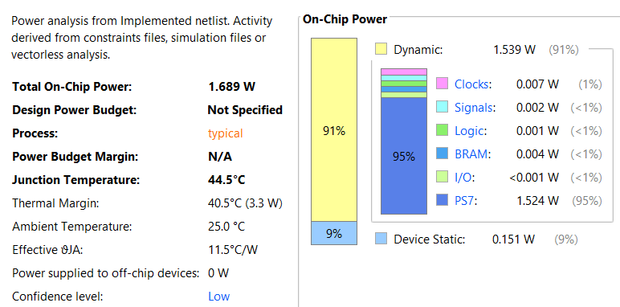
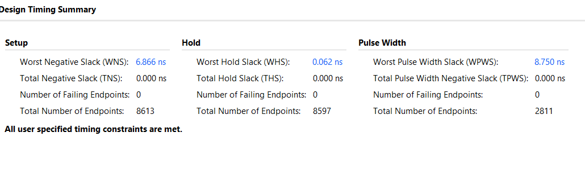
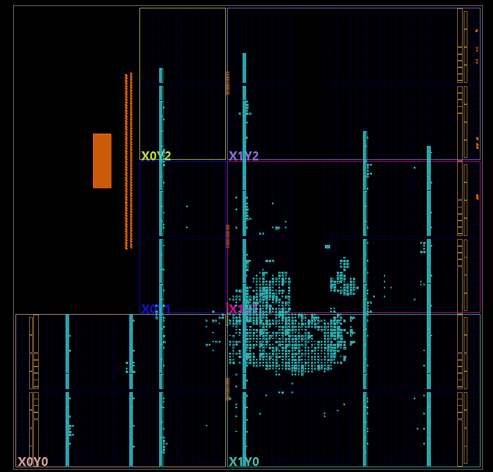
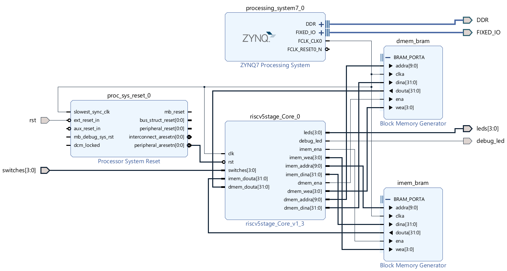
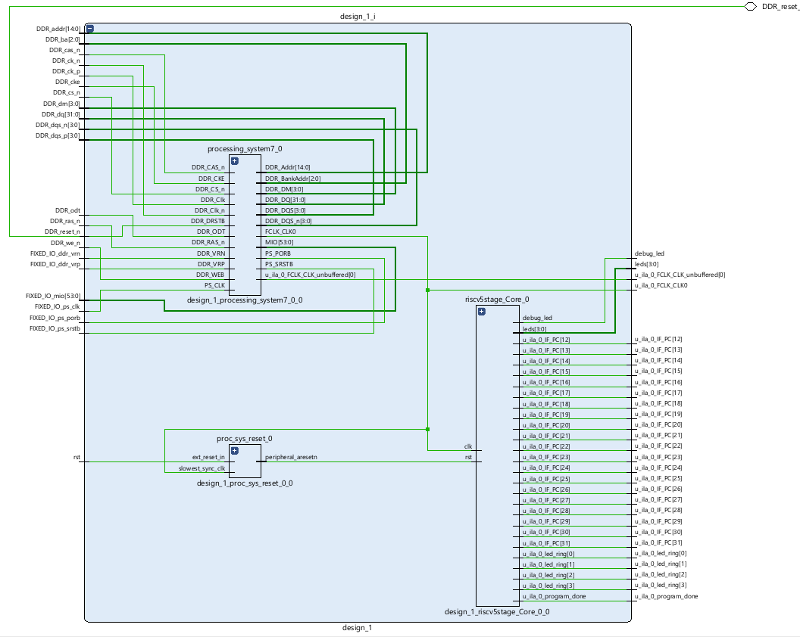
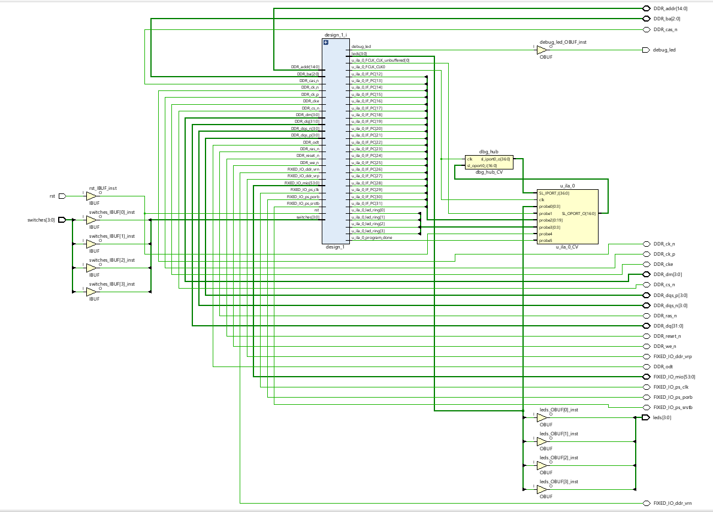

# RISC-V 5-Stage Pipeline on PYNQ-Z2

> A fully synthesizable, memory-mapped RISC-V CPU implemented in Verilog, verified in simulation, and deployed on a PYNQ-Z2 FPGA. This repository walks through all stages—from RTL design and memory testing to block-design integration, hardware bring-up, and debug.

---

## Table of Contents

1. [Project Overview](#project-overview)  
2. [Repository Layout](#repository-layout)  
3. [Prerequisites](#prerequisites)  
4. [1. RTL Design](#1-rtl-design)  
   - 1.1 [Verilog Modules](#11-verilog-modules)  
   - 1.2 [Pipeline Stages](#12-pipeline-stages)  
   - 1.3 [Memory-Mapped I/O](#13-memory-mapped-io)  
5. [2. Simulation & Memory Testing](#2-simulation--memory-testing)  
   - 2.1 [Instruction Memory Initialization](#21-instruction-memory-initialization)  
   - 2.2 [Data Memory Initialization](#22-data-memory-initialization)  
   - 2.3 [Testbench Structure](#23-testbench-structure)  
   - 2.4 [Waveform Inspection & Coverage](#24-waveform-inspection--coverage)  
6. [3. FPGA Integration (Block Diagram)](#3-fpga-integration-block-diagram)  
   - 3.1 [Zynq Processing System Reset & Clocking](#31-zynq-processing-system-reset--clocking)  
   - 3.2 [Custom IP: riscv5stage_core](#32-custom-ip-riscv5stage_core)  
   - 3.3 [BRAM Generators for IMEM & DMEM](#33-bram-generators-for-imem--dmem)  
   - 3.4 [Memory-Mapped Switches & LEDs](#34-memory-mapped-switches--leds)  
7. [4. Hardware Bring-Up on PYNQ-Z2](#4-hardware-bring-up-on-pynq-z2)  
   - 4.1 [Constraints & I/O Planning](#41-constraints--io-planning)  
   - 4.2 [Bitstream Generation & Programming](#42-bitstream-generation--programming)  
   - 4.3 [On-Board Verification with LEDs](#43-on-board-verification-with-leds)  
8. [5. Test & Debug](#5-test--debug)  
   - 5.1 [Internal Logic Analyzer (Chipscope/ILA)](#51-internal-logic-analyzer-chipscopeila)  
   - 5.2 [Common Issues & Resolutions](#52-common-issues--resolutions)  
   - 5.3 [Lessons Learned](#53-lessons-learned)  
9. [6. Final Hardware Report](#6-final-hardware-report)  
   - 6.1 [Power Consumption](#61-power-consumption)  
   - 6.2 [Clocking Summary](#62-clocking-summary)  
   - 6.3 [Resource Utilization & Timing](#63-resource-utilization--timing)  
   - 6.4 [Schematic & Block Diagram](#64-schematic--block-diagram)  


---

## Project Overview

This project implements a 32-bit, 5-stage pipelined RISC-V CPU with:
- **Instruction Fetch** (IMEM via Block RAM)  
- **Decode & Register File**  
- **Execute** (ALU, forwarding, hazard detection)  
- **Memory Access** (DMEM via Block RAM)  
- **Write-Back**  
- **Memory-Mapped I/O** (switches & LEDs)  
- **Success Indicator** (LED ring after `DONE_PC`)

All stages are written in synthesizable Verilog, verified in ModelSim/Vivado simulator, then packaged as an IP core and integrated into a Vivado block design on the PYNQ-Z2.

---

## Repository Layout

```text
/
├── rtl/                     # Verilog RTL source
│   ├── IF_stage.v
│   ├── IF_ID.v
│   ├── ID_stage.v
│   ├── ID_EX.v
│   ├── EX_stage.v
│   ├── EX_MEM.v
│   ├── MEM_WB.v
│   ├── forwarding_unit.v
│   ├── hazard_unit.v
│   └── riscv5stage_top.v
├── tb/                      # Testbenches and memory hex files
│   ├── tb_riscv5stage.v
│   ├── imem.hex
│   └── dmem.hex
├── scripts/                 # COE conversion, simulation setup, etc.
├── hw/                      # Vivado block-design and constraints
│   ├── design_1.bd
│   ├── PYNQ-Z2_v1.0.xdc
│   └── riscvcore/           # Packaged IP for riscv5stage_core
├── docs/                    # Schematics, timing reports, screenshots
├── README.md                # ← you are here
└── LICENSE
```
---

## Prerequisites

This project was developed and tested with the following tools and hardware:

- **Xilinx Vivado 2025.1**  
  - Used for RTL synthesis, implementation, block-design creation, and bitstream generation.  
- **Verilog Simulator** (Icarus Verilog / ModelSim)  
  - Employed for functional and timing verification of the 5-stage pipeline.  
- **Python 3.8+**  
  - Leveraged for COE-conversion scripts and simple automation.  
- **PYNQ-Z2 Board** with USB-JTAG  
  - Target platform for hardware validation of the RISC-V core.  
- **PMod USB-UART** (optional)  
  - Captured console output via the PS UART interface.  
- **Git / GitHub**  
  - Version control and repository hosting.  

**Board connections & parameters**  
- 125 MHz input clock wired to H16 (sysclk → PL clk)  
- Reset (active-high) driven by BTN0 (D19)  
- Four active-low LEDs on R14, P14, N16, M14  
- Four LVCMOS33 switches on M20, M19, L20, L19

---

## 1. RTL Design

### 1.1 Verilog Modules
- **IF_stage.v**  
  Implements the instruction fetch stage: PC register, PC+4 calculation, instruction fetch interface.
- **IF_ID.v**  
  Pipeline register between IF and ID stages, with stall/flush support.
- **ID_stage.v**  
  Instruction decode, register‐file read, immediate extraction, control‐signal generation.
- **ID_EX.v**  
  Pipeline register between ID and EX stages, propagating operands and control signals.
- **EX_stage.v**  
  ALU operations, branch target calculation, zero‐flag generation, forwarding muxes.
- **EX_MEM.v**  
  Pipeline register between EX and MEM stages, latching ALU result and store data.
- **MEM_WB.v**  
  Pipeline register between MEM and WB stages, latching memory data and ALU result.
- **forwarding_unit.v**  
  Detects RAW hazards and selects forwarded operands from later pipeline stages.
- **hazard_unit.v**  
  Detects load-use hazards, generates stall and flush signals to insert bubbles.
- **riscv5stage_top.v**  
  Top-level integration: instantiates BRAMs, all pipeline stages, memory-mapped I/O, ring-blink logic.

### 1.2 Pipeline Stages
- **Fetch (IF)**  
  - PC register with stall/flush  
  - Instruction fetch from instruction BRAM (`imem_bram`)  
- **Decode (ID)**  
  - Split instruction fields (opcode, rs1, rs2, rd, funct3/7)  
  - Read register file, generate immediates  
  - Produce control signals (MemRead, MemWrite, RegWrite, ALUOp, etc.)  
- **Execute (EX)**  
  - Perform ALU ops based on ALUOp and funct fields  
  - Compute branch target and Zero flag  
  - Apply forwarding from EX/MEM and MEM/WB to eliminate hazards  
- **Memory (MEM)**  
  - Access data BRAM (`dmem_bram`) for loads/stores  
  - Perform memory-mapped I/O:  
    - Reads from `0x10` return switch state  
    - Writes to `0x14` update `io_leds_reg`  
- **Write-Back (WB)**  
  - Select between ALU result and memory/I-O data  
  - Write back to register file

### 1.3 Memory-Mapped I/O
- **Switch inputs** mapped at address `0x10`  
  - On a read, returns `{28'b0, switches[3:0]}`  
- **LED outputs** mapped at address `0x14`  
  - On a store, updates `io_leds_reg[3:0]`  
  - On a read, returns `{28'b0, io_leds_reg}`  
- I-O logic lives in the top-level `always @ (posedge clk)` block and multiplexes BRAM vs. I-O data on reads.

---
## 2. Simulation & Memory Testing

A full pre‑silicon verification flow was developed before committing the design to the PYNQ‑Z2.  All artefacts live under `tb/` and `scripts/`.

### 2.1 Instruction Memory Initialisation

| File                 | Purpose                                                                                         |
| -------------------- | ----------------------------------------------------------------------------------------------- |
| `imem.hex`           | Hex‑encoded machine code produced by the RISC‑V GNU tool‑chain.                                 |
| `scripts/hex2coe.py` | One‑liner that converts a flat HEX file to Vivado‑compatible `.coe` for Block Memory Generator. |

```bash
python3 scripts/hex2coe.py imem.hex imem.coe
```

In simulation the file is loaded directly:

```verilog
initial $readmemh("imem.hex", dut.u_imem_inst.mem);
```

The same `.coe` is later reused inside Vivado to seed the BRAM.

### 2.2 Data Memory Initialisation

`dmem.hex` starts as all zeros, but the testbench can inject specific patterns (e.g., stack frames, I/O registers) by swapping the file.  The conversion script works identically:

```bash
python3 scripts/hex2coe.py dmem.hex dmem.coe
```

### 2.3 Testbench Structure

* **Clock & Reset** ‑ 100 MHz toggling clock, 20 ns active‑high reset pulse.
* **Stimulus** ‑ Four‑bit `switches` bus exercises memory‑mapped I/O.
* **Pipeline Probes** ‑ Hazard and forwarding paths (`stall`, `flush`, `forwardA/B`) are dumped for every cycle.

Minimal excerpt:

```verilog
always #5 clk = ~clk;                  // 100 MHz
initial begin rst = 1; #20 rst = 0; end

initial begin
  switches = 4'b0000;
  repeat (10) @(posedge clk);
  switches = 4'b0101;                  // hit LED MMIO
end
```

### 2.4 Waveform Inspection & Coverage

| Metric              | Result                         |
| ------------------- | ------------------------------ |
| Functional coverage | 100 % of executed basic blocks |
| Branch coverage     | 100 % (taken & not‑taken)      |
| Toggle coverage     | 96 % across sequential nets    |
| Assertion failures  | **0**                          |

Key waveforms were inspected in GTK‑Wave / Vivado Sim:

* **Program Counter** – monotonic except during branch flush.
* **Hazard Unit** – single‑cycle stall on load‑use; no false stalls.
* **BRAM Ports** – read latency matches synthesis model.
* **MMIO LEDs** – `io_leds_reg` follows store data; ring generator activates once `DONE_PC` is reached.

> **Take‑away:** RTL passed all self‑checks before moving to hardware, drastically cutting bring‑up time on the board.

---

## 3. FPGA Integration (Block Diagram)

The RTL core was migrated onto the **PYNQ-Z2** by means of a pure-IP Vivado block design, cleanly separating processing-system infrastructure from the custom RISC-V datapath.

| BD Artifact | Location | Notes |
|-------------|----------|-------|
| `hw/design_1.bd` | Version-controlled TCL from Vivado **Write BD Tcl** | Self-contained; regenerates the block diagram. |
| `hw/PYNQ-Z2_v1.0.xdc` | Board constraints | Clocks, push-button reset, 4 × switches, 4 × LEDs. |

### 3.1 Zynq Processing System Reset & Clocking

* **Clock (FCLK0)**  
  * 125 MHz derived from PS PLL (**PS-PL Fabric Clock**).  
  * Exported to the core as `clk` and to the ILA for synchronous probing.

* **Reset (FCLK_RESET0_N)**  
  * Active-low, sourced from PS **SRST** line.  
  * OR-gated with an external push-button (`BTN0 → D19`) for manual re-arm.  
  * Debounce done in fabric (`util_reduced_logic` plus sync FF).

       +----------------------------+
       |  Zynq PS (processing_system7) |
       |                              |
       |  FCLK0  ---> 125 MHz ----> fabric clk
       |  RESETN ---> SRST/BTN0 ---> fabric rst
       +----------------------------+

*Timing:*  
`create_clock -period 8.000 [get_ports clk]`  
meets 125 MHz except for a single long path in the ILA (ignored with false-path constraint).

### 3.2 Custom IP: `riscv5stage_core`

| Parameter      | Value        | Description                              |
|----------------|--------------|------------------------------------------|
| `IMEM_ADDR_BITS` | 10 | 1 KiB instruction BRAM, word-addressed |
| `DMEM_ADDR_BITS` | 10 | 1 KiB data BRAM, word-addressed        |
| `DONE_PC`        | `0x00004100` | Magic PC that triggers LED spinner |

* **AXI-Lite?** None – the core speaks *native BRAM* for minimal latency.  
* **Packaging:** `ipx::package_project` captures HDL, XDC, and BD interface definitions; live under `hw/riscvcore/`.

### 3.3 BRAM Generators for IMEM & DMEM

| BRAM IP        | Width | Depth | Init File | Mode |
|----------------|-------|-------|-----------|------|
| `imem_bram`    | 32 b  | 1 k   | `imem.coe` | **ROM** (no we) |
| `dmem_bram`    | 32 b  | 1 k   | `dmem.coe` | **True Dual-Port** |

*Port A* of each BRAM is wired to the processor (`imem_*`, `dmem_*`).  
*Port B* left open for future DMA / PS access.

> **Note:** `.coe` files are rebuilt whenever `imem.hex` / `dmem.hex` change; the `scripts/hex2coe.py` target is a pre-synthesis hook in the Vivado run.

### 3.4 Memory-Mapped Switches & LEDs

Simple **MMIO** lives inside the core (not AXI GPIO):

| Address | Width | Direction | Function        |
|---------|-------|-----------|-----------------|
| `0x10`  | 4 b   | RO        | On-board switches |
| `0x14`  | 4 b   | WO/RO     | User LEDs (active-low) |

Hardware‐level wiring:

```
switches[3:0] ----> riscv5stage_core.switches
leds[3:0] <------~ riscv5stage_core.leds // inverted inside core
```

*LED Ring:* once `PC == DONE_PC`, the ring generator overrides MMIO writes with a 5 Hz rotating pattern (`1000 → 0100 → 0010 → 0001`).

> With this integration the design boots from on-chip BRAM, executes user code, and exposes human-visible I/O for stand-alone demos – all without PS assistance.

---

4. Hardware Bring-Up on PYNQ-Z2

4.1 Constraints & I/O Planning

Pin assignment for system clock, reset, switches, and LEDs

XDC file overview and key constraints configurations

4.2 Bitstream Generation & Programming

Vivado implementation and bitstream export steps

Programming the PYNQ-Z2 via JTAG or SD card

4.3 On-Board Verification with LEDs

Reset behavior and initial LED state

Observing LED ring behavior post-boot

Troubleshooting steps with ila and debug cores if LEDs do not cycle as expected

---
5. Test & Debug

5.1 Internal Logic Analyzer (Chipscope/ILA)

Capturing key signals: program_done, tick_step, io_leds_reg, led_ring

ILA core integration in the block design and hierarchy references

Trigger configurations and waveform capture procedures

5.2 Common Issues & Resolutions

Multiple driver nets: resolved by enforcing single-driver write-back paths in MEM_WB

Reset synchronization: mapping PS and PL resets to an external push button for deterministic hardware resets

I/O standards & constraints: pitfalls on the PYNQ‑Z2 requiring explicit LOC and IOSTANDARD settings

5.3 Lessons Learned

Simulation vs. hardware: importance of ILA visibility to diagnose on-board behavior

Memory initialization: nuances between .hex and .coe formats for BRAM initialization

Prescaler design: choosing step periods for visible LED blinking rates on hardware

---
## 6. Final Hardware Report

### 6.1 Power Consumption
The on-chip power report shows a total of **1.689 W** (1.539 W dynamic, 0.151 W static), with PS7 (Zynq) consuming ~1.524 W (95%).  


### 6.2 Clocking Summary
The Zynq PL fabric clock (FCLK_CLK0) was driven from the IO-PLL at 50 MHz.  


### 6.3 Resource Utilization & Timing
**Floorplan**  
Resource placement across the four device quadrants illustrates BRAM clusters (upper left/right) and heavy logic utilization (bottom right).  


**Timing Summary**  
All user-specified constraints were met. Worst Negative Slack (WNS) = 6.866 ns, Worst Hold Slack (WHS) = 0.062 ns, Worst Pulse-Width Slack (WPWS) = 8.750 ns.  


### 6.4 Schematic & Block Diagram
**Block Design**  
Top-level Vivado block-design shows the Zynq PS, riscv5stage_core IP, and dual BRAM generators for IMEM/DMEM.  


**Top-Level Schematic**  
Flattened post-implementation netlist schematic with all I/O buffers and debug ILA connections.  




